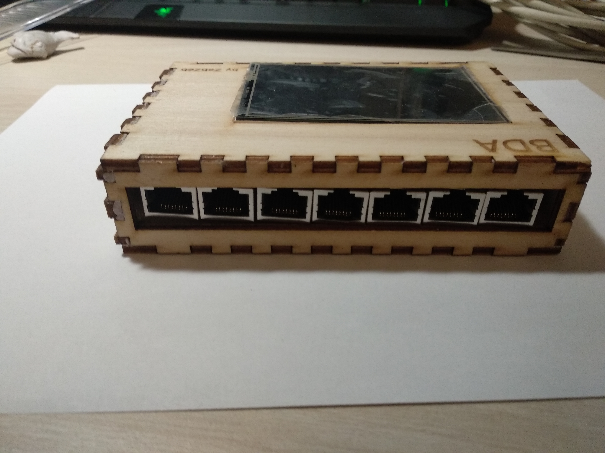

# Buzzer button

This project has a maximum of 10 buzzers, but you can play with 1,2...10 buzzers plug anywhere.
<br>
The buzzer library can support more buzzers.


> ## Library
* Buzzer.h
* Adafruit_GFX.h
* Adafruit_TFTLCD.h
* TouchScreen.h

> ## Structure
```
typedef struct Buzzer {
    int pin_button;
    int pin_led;
    int number;
    int team;
    int score;
    bool used;
} Buzzer;
```
```
typedef struct Button {
    int x;
    int y;
    int x_size;
    int y_size;
    String string;
    int size_string;
    uint16_t color_string;
    uint16_t color_background;
} Button;
```
> ## Initialisation / Use of buzzers

Parameters 
* first (10) is the maximun of buzzers
* second (false) enable to get teminal display (put true to dev)

```
Buzzers buzzers(10, false);

Buzzer buzzer[] = {{51, 45, -1, -1, 0, false},
                   {27, 31, -1, -1, 0, false},
                   {29, 25, -1, -1, 0, false},
                   {26, 24, -1, -1, 0, false},
                   {35, 40, -1, -1, 0, false},
                   {37, 32, -1, -1, 0, false},
                   {41, 46, -1, -1, 0, false},
                   {28, 44, -1, -1, 0, false},
                   {30, 42, -1, -1, 0, false},
                   {39, 33, -1, -1, 0, false},
};
```
Now we can use different fonctions of Buzzer library :

```
    buzzers.ledOffAllBuzzer(buzzer);

    buzzers.blinkAllBuzzer(buzzer);

    buzzers.displayAllInfosBuzzer(buzzer);

    ...
```

> ##  Initialisation / Use on touch button 


```
#define    BLACK   0x0000
#define    BLUE    0x001F

#define WIDTH_SCREEN 480
#define HEIGHT_SCREEN 320

#define BOXSIZE_X 250
#define BOXSIZE_Y 75

#define CENTER_BOX_X (WIDTH_SCREEN / 2 - BOXSIZE_X / 2)

Button your_button = {CENTER_BOX_X, HEIGHT_SCREEN / 1.5, BOXSIZE_X, BOXSIZE_Y, "Terminer", 3, BLACK, BLUE};
```


Code to draw a button:

```
 drawButton(&your_button);
```

Code to get buttons' state:

```
 if (touchButton(&your_button)) {
     ...instructions...
 }
```


> ## Hardware

* 10 push button + leds
`link :` https://www.amazon.fr/gp/product/B01MSNXLN0/ref=oh_aui_detailpage_o01_s00?ie=UTF8&psc=1 (36.36€)
* touch screen tft 3.5
`link :`  https://www.amazon.fr/gp/product/B075CXXL1M/ref=oh_aui_detailpage_o01_s01?ie=UTF8&psc=1 (19.99€)
* arduino MEGA 
`link :`  https://www.amazon.fr/gp/product/B06XKZY117/ref=oh_aui_detailpage_o02_s00?ie=UTF8&psc=1 (12.99€)
* 10 RJ45 5m 
`link :`  https://www.amazon.fr/gp/product/B003SPBYVI/ref=oh_aui_detailpage_o02_s00?ie=UTF8&psc=1 (18.44€)
* 10 RJ45 pcb mount 
`link :`  https://www.amazon.fr/gp/product/B01J3UEFJO/ref=oh_aui_detailpage_o02_s00?ie=UTF8&psc=1 (10.41€)
* 10 NPN transistors BD437
* 10 resistors 10k ohm
* 1 pcb board  


